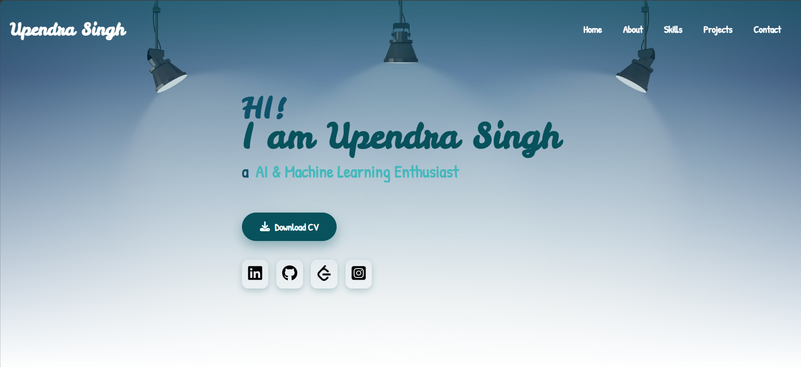
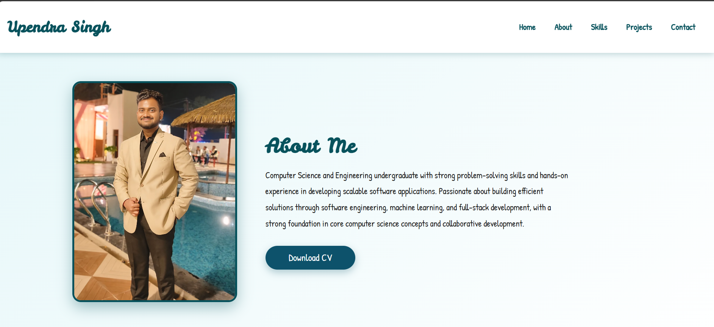
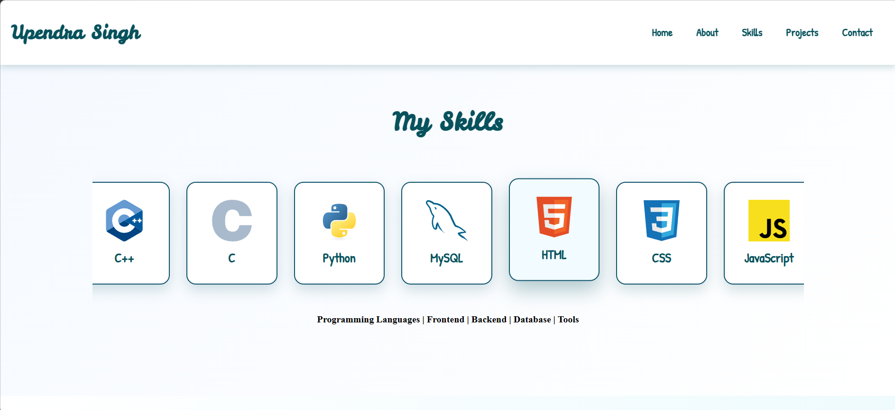
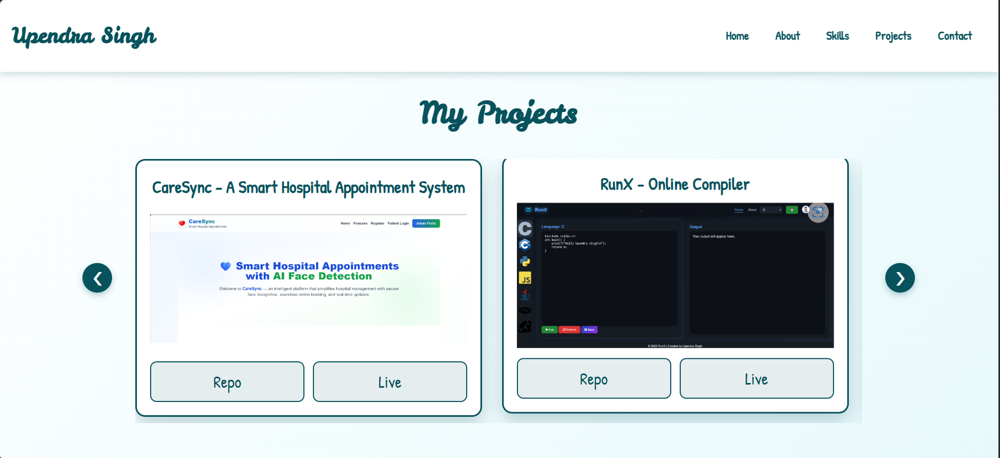
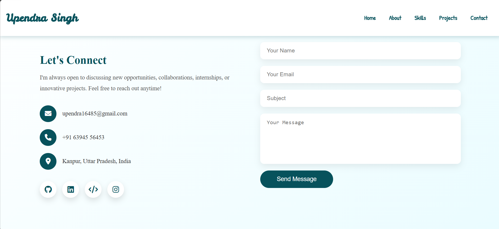

# Upendra Singh – Portfolio

<p align="center">
  
</p>

## About Me

I am a **Computer Science and Engineering undergraduate** passionate about building scalable software solutions, full-stack web applications, and AI-powered systems. I enjoy solving real-world problems through clean code, continuous learning, and collaborative development.

* B.Tech (Computer Science & Engineering) | 2023–2027
* Full Stack Web Development
* Machine Learning & Generative AI
* Data Science & Analytics
* Cybersecurity
* Continuously learning modern technologies and software engineering best practices

---

## Live Portfolio

**Website:**
[[https://your-portfolio-link.com](https://upendra-portfolio-tau.vercel.app/)](https://upendra-portfolio-tau.vercel.app/)

---

## Features

* Responsive and modern design
* Smooth scrolling navigation
* Professional About section
* Technical Skills showcase
* Featured Projects
* Education section
* Certifications
* Contact section
* Mobile-friendly interface
* Clean and intuitive user experience

---

## Tech Stack

### Frontend

* HTML5
* CSS3
* JavaScript

### Tools

* Git
* GitHub
* VS Code

---

## Portfolio Preview

### Home

<p align="center">

</p>

### About

<p align="center">

</p>

### Skills

<p align="center">

</p>

### Projects

<p align="center">

</p>

### Contact

<p align="center">

</p>

---

## Featured Projects

### CareNavigator – Smart Hospital Appointment System

* Smart hospital appointment management system
* Secure authentication and appointment booking
* Responsive user interface
* Full-stack web application

### GenTwin – AI-Driven Digital Twin for Cybersecurity Gap Detection

* AI-powered cybersecurity gap detection
* Digital Twin-based security analysis
* Machine learning-driven risk assessment
* Actionable security insights

### Cyber Threat Intelligence Dashboard

* Flask-based cybersecurity dashboard
* CVE data collection and analysis
* MongoDB database integration
* Interactive charts and security analytics

---

## Project Structure

```text
Portfolio/
│
├── images/
├── index.html
├── style.css
├── script.js
└── README.md
```

---

## Getting Started

Clone the repository:

```bash
git clone https://github.com/Upendra2313845/Upendra-Portfolio.git
```

Navigate to the project directory:

```bash
cd Upendra-Portfolio
```

Open `index.html` in your preferred web browser.

---

## Contact

* **GitHub:** https://github.com/Upendra2313845
* **LinkedIn:** https://linkedin.com/in/your-linkedin
* **Email:** [upendra16485@gmail.com](mailto:upendra16485@gmail.com)

---

## License

This project is licensed under the MIT License.
